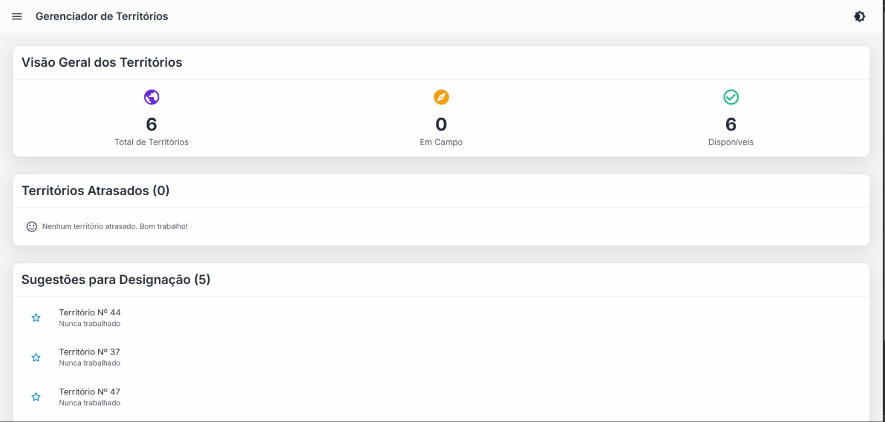
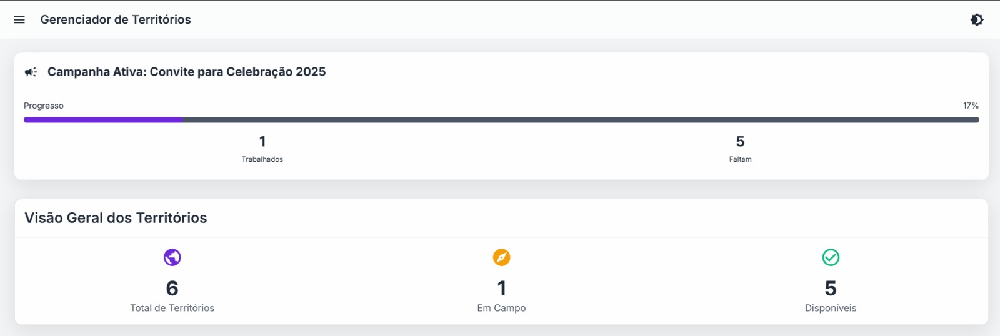

# 📖 Uso na Congregação (JW)

O aplicativo **GenTerritórios** foi desenvolvido para auxiliar no gerenciamento de territórios da sua congregação, tornando o processo mais simples, organizado e prático.

---

## ⚙️ Funcionalidades

- **Gerenciar territórios**  
  Adicionar, editar e excluir territórios facilmente.

- **Criar grupos**  
  Criar grupos e vincular os respectivos territórios a eles.

- **Designar territórios**  
  Atribuir territórios diretamente a dirigentes.

- **Cadastrar dirigentes**  
  Gerenciar informações dos responsáveis pelos territórios.

- **Histórico de designações**  
  Consultar quando e para quem cada território foi designado.

- **Campanhas especiais**  
  Criar campanhas para ocasiões como:
  - Visita do superintendente  
  - Convites para o congresso  
  - Outras necessidades da congregação

---

## 📊 Dashboard Interativo

A tela inicial oferece uma visão completa do andamento dos territórios:

- ✅ Territórios em campo  
- 📌 Territórios disponíveis  
- ⏳ Territórios atrasados (sem trabalhar há 3 meses)  

Além disso, o sistema traz **sugestões automáticas**:  
- Lista dos **5 territórios que estão há mais tempo sem trabalhar**

---

## 🖼️ Exemplos do Dashboard

### Dashboard principal
Aqui você pode ver o resumo geral dos territórios:

---

### Dashboard com campanha ativa
Quando há uma campanha ativa, um **novo card** é exibido mostrando:

- Quantos territórios já foram trabalhados na campanha  
- Quantos ainda faltam  
- Uma visão geral do progresso

---

## 💻 Disponibilidade

- **Desktop**  
- **Mobile (responsivo)**  
- **Modo claro e escuro**

---

## 💡 Sugestões

Sinta-se à vontade para enviar ideias e sugestões de melhoria.  
Seu feedback ajuda a tornar o **GenTerritórios** cada vez melhor para o uso da congregação.
